# Diagramas do Projeto — RA3 9 (Fase 3)

Este arquivo reúne os diagramas em **Mermaid** que ajudam a entender a
arquitetura, o fluxo de dados e a execução do analisador sintático LL(1)
acrescido da camada **semântica** da Fase 3.

> Atualização Fase 3: ver a §13 "Pré-processamento de comentários"
> abaixo (AFD ampliado com o estado `EM_COMENTARIO`) e o pipeline
> completo na §1, que agora inclui as etapas `construirTabelaSimbolos`,
> `verificarTipos`, `gerarArvoreAtribuida` e o controle de fluxo que
> impede geração de Assembly em presença de erros semânticos.
Todos podem ser visualizados diretamente no GitHub ou no VS Code com a
extensão *Markdown Preview Mermaid Support*.

> Sumário rápido: [Pipeline](#1-pipeline-end-to-end-fluxograma) ·
> [Módulos](#2-arquitetura-de-módulos-relação-entre-arquivos) ·
> [Construção da gramática](#3-construirgramatica--first--follow--tabela) ·
> [Parser LL(1)](#4-parser-ll1-com-pilha-passo-a-passo) ·
> [AFD da Fase 1](#5-afd-do-lexer-fase-1) ·
> [Estruturas de controle](#6-estruturas-de-controle-state-diagram) ·
> [AST](#7-tipos-de-nó-da-ast-classes) ·
> [Sequência completa](#8-sequência-completa-de-uma-execução) ·
> [Ponto fixo FIRST/FOLLOW](#9-firstfollow--fluxo-do-ponto-fixo) ·
> [Tabela LL(1)](#10-construção-da-tabela-ll1--fluxo-de-decisão) ·
> [Aridade no gerarArvore](#11-decisão-por-aridade-no-parse_expr-gerararvore) ·
> [Árvore de derivação LL(1)](#12-árvore-de-derivação-ll1-exemplo-real)

---

## 1. Pipeline end-to-end (fluxograma)

Visão macro do que acontece ao executar `python AnalisadorSemantico.py teste1.txt`.

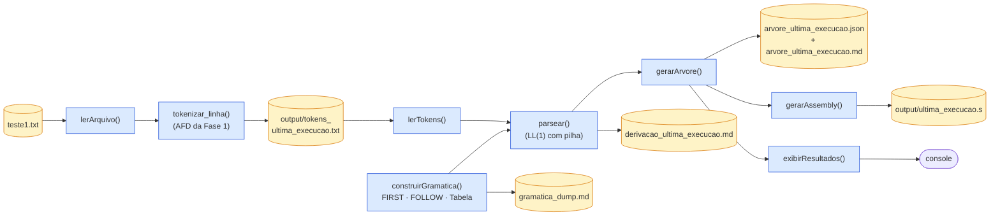
```mermaid
flowchart LR
    A[("teste1.txt")] --> B["lerArquivo()"]
    B --> C["tokenizar_linha()<br/>(AFD da Fase 1)"]
    C --> D[("output/tokens_<br/>ultima_execucao.txt")]
    D --> E["lerTokens()"]
    F["construirGramatica()<br/>FIRST · FOLLOW · Tabela"] --> G
    E --> G["parsear()<br/>(LL(1) com pilha)"]
    G --> H["gerarArvore()"]
    H --> I[("arvore_ultima_execucao.json<br/>+ arvore_ultima_execucao.md")]
    H --> J["gerarAssembly()"]
    J --> K[("output/ultima_execucao.s")]
    H --> L["exibirResultados()"]
    L --> M(["console"])
    F --> N[("gramatica_dump.md")]
    G --> O[("derivacao_ultima_execucao.md")]

    classDef io fill:#fef3c7,stroke:#d97706
    classDef step fill:#dbeafe,stroke:#1d4ed8
    class A,D,I,K,N,O io
    class B,C,E,G,H,J,L,F step
```

---

## 2. Arquitetura de módulos (relação entre arquivos)

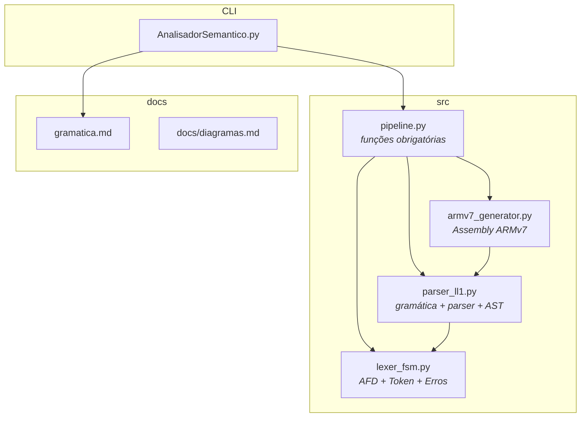
```mermaid
flowchart TB
    subgraph CLI
        main["AnalisadorSemantico.py"]
    end

    subgraph src
        pipe["pipeline.py<br/><i>funções obrigatórias</i>"]
        lex["lexer_fsm.py<br/><i>AFD + Token + Erros</i>"]
        par["parser_ll1.py<br/><i>gramática + parser + AST</i>"]
        gen["armv7_generator.py<br/><i>Assembly ARMv7</i>"]
    end

    subgraph docs
        gram["gramatica.md"]
        diag["docs/diagramas.md"]
    end

    main --> pipe
    pipe --> lex
    pipe --> par
    pipe --> gen
    par  --> lex
    gen  --> par
    main --> gram
```

---

## 3. `construirGramatica()` — FIRST → FOLLOW → Tabela

Como a estrutura de dados retornada por `construirGramatica()` é montada.

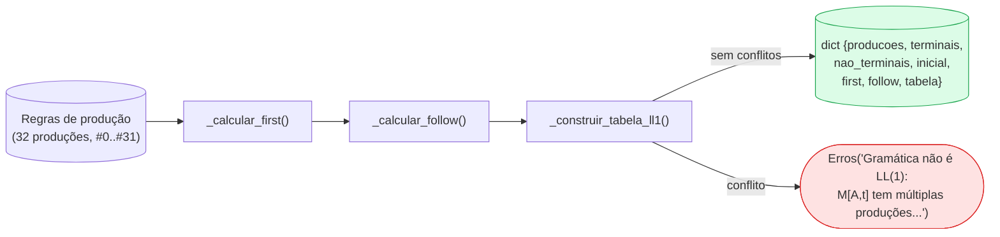
```mermaid
flowchart LR
    R[("Regras de produção<br/>(32 produções, #0..#31)")] --> F1["_calcular_first()"]
    F1 --> F2["_calcular_follow()"]
    F2 --> T["_construir_tabela_ll1()"]
    T -->|sem conflitos| OK[("dict {producoes, terminais,<br/>nao_terminais, inicial,<br/>first, follow, tabela}")]
    T -->|conflito| ERR(["Erros('Gramática não é LL(1):<br/>M[A,t] tem múltiplas produções...')"])

    classDef ok fill:#dcfce7,stroke:#16a34a
    classDef err fill:#fee2e2,stroke:#dc2626
    class OK ok
    class ERR err
```

---

## 4. Parser LL(1) com pilha (passo a passo)

Algoritmo executado por `parsear(tokens, gram)`.

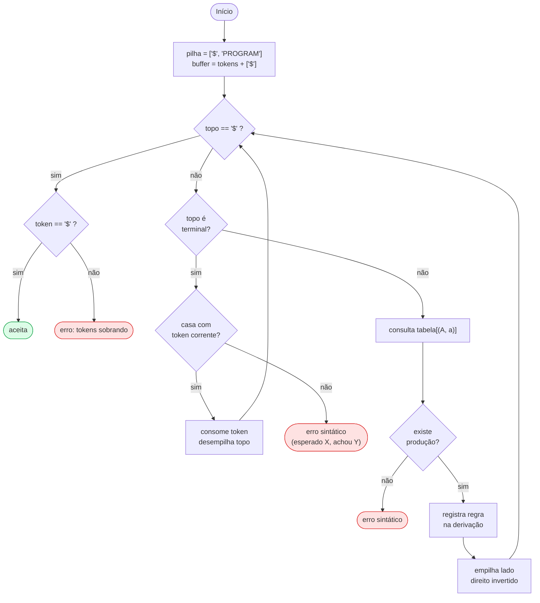
```mermaid
flowchart TD
    A([Início]) --> B["pilha = ['$', 'PROGRAM']<br/>buffer = tokens + ['$']"]
    B --> C{"topo == '$' ?"}
    C -- sim --> D{"token == '$' ?"}
    D -- sim --> OK([aceita])
    D -- não --> E1(["erro: tokens sobrando"])
    C -- não --> F{"topo é<br/>terminal?"}
    F -- sim --> G{"casa com<br/>token corrente?"}
    G -- sim --> H["consome token<br/>desempilha topo"]
    H --> C
    G -- não --> E2(["erro sintático<br/>(esperado X, achou Y)"])
    F -- não --> I["consulta tabela[(A, a)]"]
    I --> J{"existe<br/>produção?"}
    J -- não --> E3(["erro sintático"])
    J -- sim --> K["registra regra<br/>na derivação"]
    K --> L["empilha lado<br/>direito invertido"]
    L --> C

    classDef err fill:#fee2e2,stroke:#dc2626
    classDef ok  fill:#dcfce7,stroke:#16a34a
    class E1,E2,E3 err
    class OK ok
```

---

## 5. AFD do lexer (Fase 1)

Diagrama dos estados do AFD do lexer (Fase 1) que continua em uso na Fase 2,
agora reconhecendo também operadores relacionais e as keywords `IF`,
`IFELSE`, `WHILE`, `START`, `END`, `RES`. O **lexema** é mantido em
MAIÚSCULAS pelo lexer; a conversão para terminal minúsculo (`if`,
`while`, …) ocorre depois em `_token_para_terminal()`.

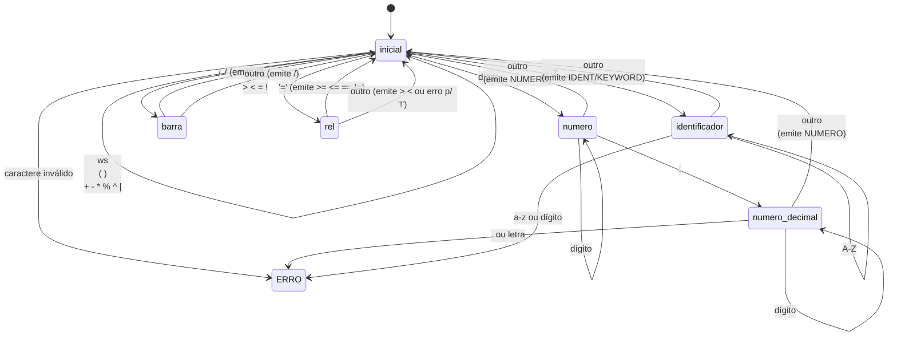
```mermaid
stateDiagram-v2
    [*] --> inicial

    inicial --> inicial: ws<br/>( )<br/>+ - * % ^ \|
    inicial --> numero: dígito
    inicial --> identificador: A-Z
    inicial --> barra: /
    inicial --> rel: > < = !
    inicial --> ERRO: caractere inválido

    numero --> numero: dígito
    numero --> numero_decimal: .
    numero --> inicial: outro<br/>(emite NUMERO)

    numero_decimal --> numero_decimal: dígito
    numero_decimal --> inicial: outro<br/>(emite NUMERO)
    numero_decimal --> ERRO: . ou letra

    identificador --> identificador: A-Z
    identificador --> inicial: outro<br/>(emite IDENT/KEYWORD)
    identificador --> ERRO: a-z ou dígito

    barra --> inicial: / (emite //)
    barra --> inicial: outro (emite /)

    rel --> inicial: '=' (emite >= <= == !=)
    rel --> inicial: outro (emite > < ou erro p/ '!')
```

---

## 6. Estruturas de controle (state diagram)

Como o parser interpreta cada construção depois que a AST é montada.

### 6.1. IF / IFELSE

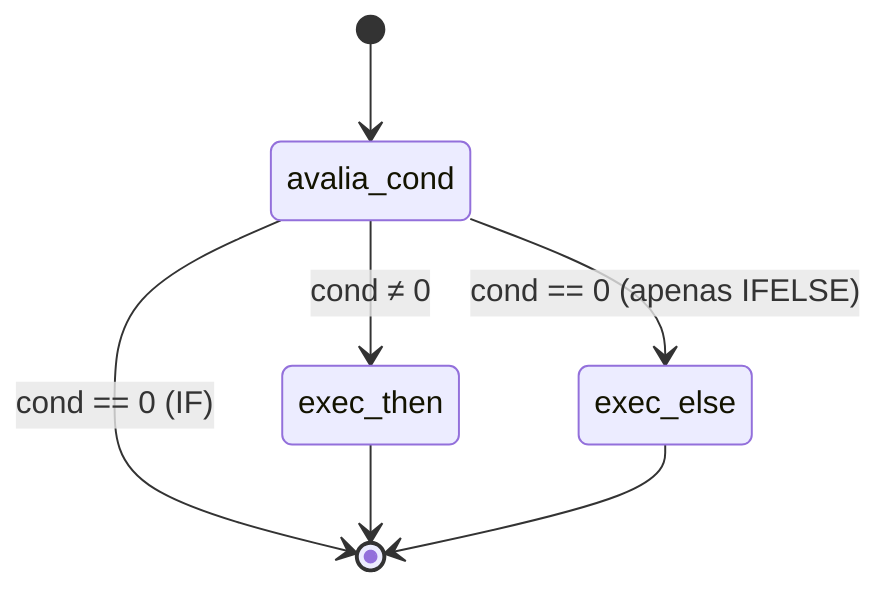
```mermaid
stateDiagram-v2
    [*] --> avalia_cond
    avalia_cond --> exec_then: cond ≠ 0
    avalia_cond --> exec_else: cond == 0 (apenas IFELSE)
    avalia_cond --> [*]: cond == 0 (IF)
    exec_then --> [*]
    exec_else --> [*]
```

### 6.2. WHILE

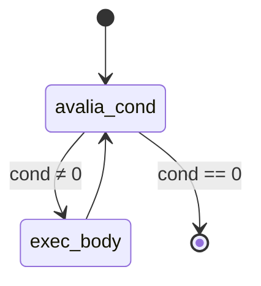
```mermaid
stateDiagram-v2
    [*] --> avalia_cond
    avalia_cond --> exec_body: cond ≠ 0
    avalia_cond --> [*]:    cond == 0
    exec_body --> avalia_cond
```

---

## 7. Tipos de nó da AST (classes)

Estrutura dos `dict`s produzidos por `gerarArvore()`. Útil para quem for
consumir `output/arvore_ultima_execucao.json`.

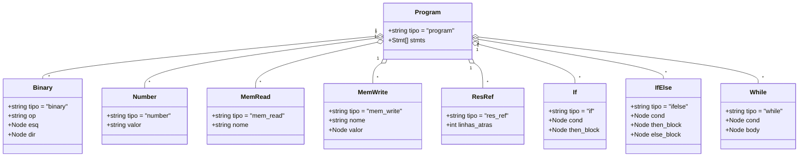
```mermaid
classDiagram
    class Program {
        +string tipo = "program"
        +Stmt[] stmts
    }
    class Binary {
        +string tipo = "binary"
        +string op
        +Node esq
        +Node dir
    }
    class Number {
        +string tipo = "number"
        +string valor
    }
    class MemRead {
        +string tipo = "mem_read"
        +string nome
    }
    class MemWrite {
        +string tipo = "mem_write"
        +string nome
        +Node valor
    }
    class ResRef {
        +string tipo = "res_ref"
        +int linhas_atras
    }
    class If {
        +string tipo = "if"
        +Node cond
        +Node then_block
    }
    class IfElse {
        +string tipo = "ifelse"
        +Node cond
        +Node then_block
        +Node else_block
    }
    class While {
        +string tipo = "while"
        +Node cond
        +Node body
    }

    Program "1" o-- "*" Binary
    Program "1" o-- "*" Number
    Program "1" o-- "*" MemRead
    Program "1" o-- "*" MemWrite
    Program "1" o-- "*" ResRef
    Program "1" o-- "*" If
    Program "1" o-- "*" IfElse
    Program "1" o-- "*" While
```

---

## 8. Sequência completa de uma execução

Interação entre os principais módulos quando o usuário roda
`python AnalisadorSemantico.py teste1.txt`.

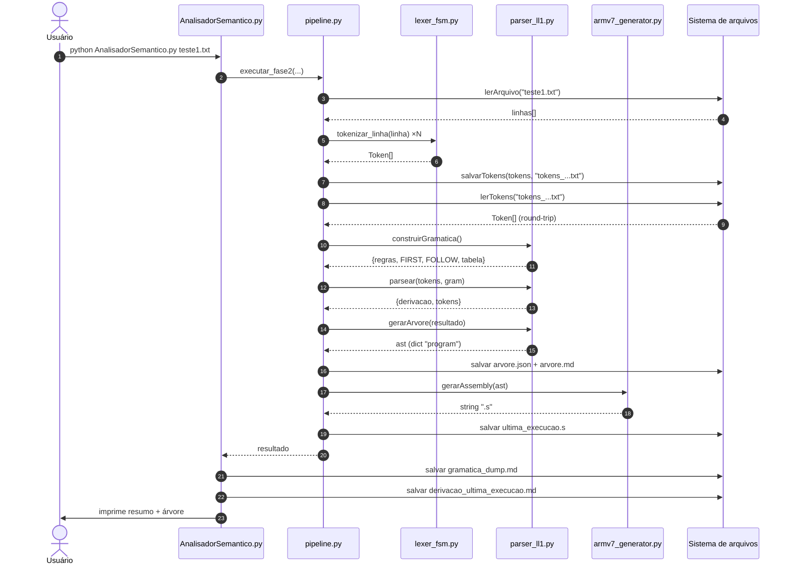
```mermaid
sequenceDiagram
    autonumber
    actor U as Usuário
    participant M as AnalisadorSemantico.py
    participant P as pipeline.py
    participant L as lexer_fsm.py
    participant G as parser_ll1.py
    participant A as armv7_generator.py
    participant FS as Sistema de arquivos

    U->>M: python AnalisadorSemantico.py teste1.txt
    M->>P: executar_fase2(...)
    P->>FS: lerArquivo("teste1.txt")
    FS-->>P: linhas[]
    P->>L: tokenizar_linha(linha) ×N
    L-->>P: Token[]
    P->>FS: salvarTokens(tokens, "tokens_...txt")
    P->>FS: lerTokens("tokens_...txt")
    FS-->>P: Token[] (round-trip)
    P->>G: construirGramatica()
    G-->>P: {regras, FIRST, FOLLOW, tabela}
    P->>G: parsear(tokens, gram)
    G-->>P: {derivacao, tokens}
    P->>G: gerarArvore(resultado)
    G-->>P: ast (dict "program")
    P->>FS: salvar arvore.json + arvore.md
    P->>A: gerarAssembly(ast)
    A-->>P: string ".s"
    P->>FS: salvar ultima_execucao.s
    P-->>M: resultado
    M->>FS: salvar gramatica_dump.md
    M->>FS: salvar derivacao_ultima_execucao.md
    M->>U: imprime resumo + árvore
```

---

## 9. FIRST/FOLLOW — fluxo do ponto fixo

Como `_calcular_first` e `_calcular_follow` convergem por iteração até
nenhum conjunto mudar.

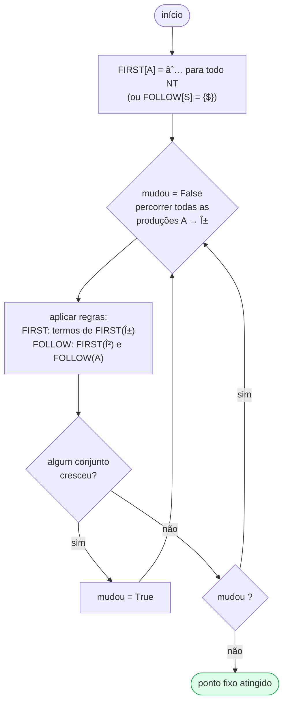
```mermaid
flowchart TD
    S([início]) --> I["FIRST[A] = ∅ para todo NT<br/>(ou FOLLOW[S] = {$})"]
    I --> L{"mudou = False<br/>percorrer todas as<br/>produções A → α"}
    L --> P["aplicar regras:<br/>FIRST: termos de FIRST(α)<br/>FOLLOW: FIRST(β) e FOLLOW(A)"]
    P --> Q{"algum conjunto<br/>cresceu?"}
    Q -- sim --> M["mudou = True"]
    M --> L
    Q -- não --> C{"mudou ?"}
    C -- sim --> L
    C -- não --> F([ponto fixo atingido])

    classDef ok fill:#dcfce7,stroke:#16a34a
    class F ok
```

> A garantia de terminação vem do fato de que os conjuntos só
> **crescem** (são monótonos) e o universo de terminais é finito.

---

## 10. Construção da tabela LL(1) — fluxo de decisão

Como cada produção contribui para a tabela `M[A, t]` em
`_construir_tabela_ll1()`.

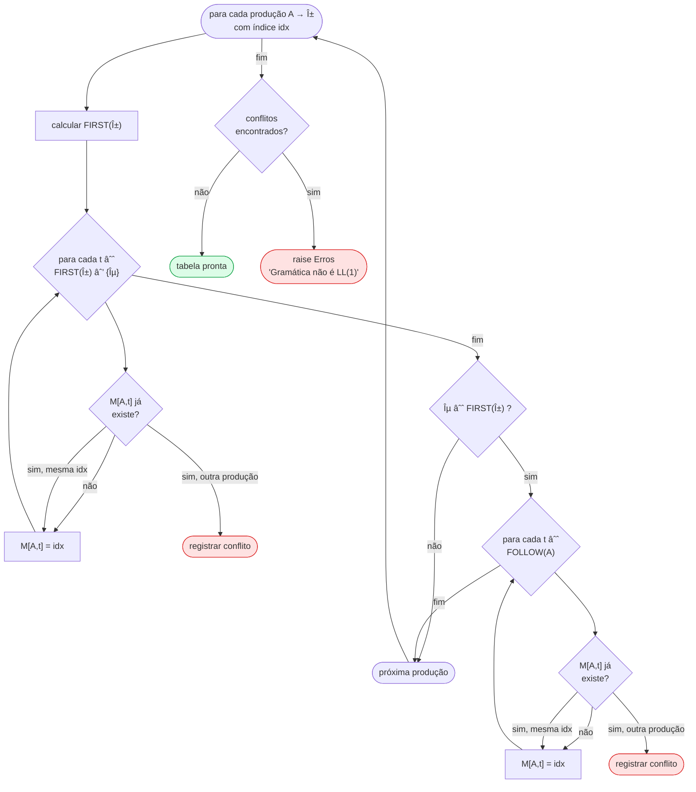
```mermaid
flowchart TD
    A([para cada produção A → α<br/>com índice idx]) --> B["calcular FIRST(α)"]
    B --> C{"para cada t ∈<br/>FIRST(α) − {ε}"}
    C --> D{"M[A,t] já<br/>existe?"}
    D -- não --> E["M[A,t] = idx"]
    D -- sim, mesma idx --> E
    D -- sim, outra produção --> X1(["registrar conflito"])
    E --> C
    C -- fim --> F{"ε ∈ FIRST(α) ?"}
    F -- não --> Z([próxima produção])
    F -- sim --> G{"para cada t ∈<br/>FOLLOW(A)"}
    G --> H{"M[A,t] já<br/>existe?"}
    H -- não --> I["M[A,t] = idx"]
    H -- sim, mesma idx --> I
    H -- sim, outra produção --> X2(["registrar conflito"])
    I --> G
    G -- fim --> Z
    Z --> A
    A -- fim --> R{"conflitos<br/>encontrados?"}
    R -- não --> OK([tabela pronta])
    R -- sim --> ERR(["raise Erros<br/>'Gramática não é LL(1)'"])

    classDef err fill:#fee2e2,stroke:#dc2626
    classDef ok fill:#dcfce7,stroke:#16a34a
    class X1,X2,ERR err
    class OK ok
```

---

## 11. Decisão por aridade no `parse_expr` (gerarArvore)

Como `gerarArvore()` usa o **número de itens** dentro dos parênteses
para escolher o tipo do nó da AST. Esse é o "outro lado" do que torna
a gramática LL(1): a palavra-chave/operador final de cada expressão é
o discriminador.

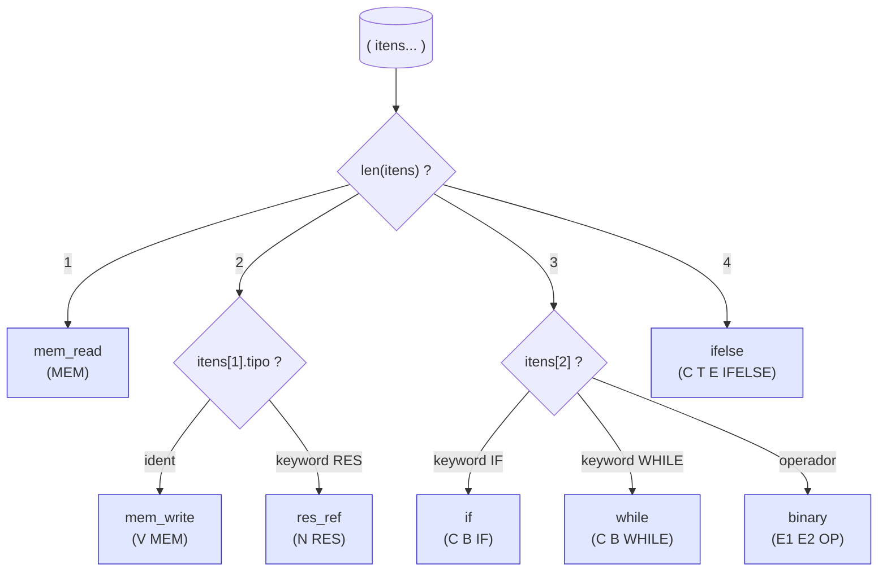
```mermaid
flowchart TD
    P[("(  itens...  )")] --> N{"len(itens) ?"}
    N -- 1 --> A1["mem_read<br/>(MEM)"]
    N -- 2 --> B{"itens[1].tipo ?"}
    B -- ident --> A2["mem_write<br/>(V MEM)"]
    B -- "keyword RES" --> A3["res_ref<br/>(N RES)"]
    N -- 3 --> C{"itens[2] ?"}
    C -- "keyword IF" --> A4["if<br/>(C B IF)"]
    C -- "keyword WHILE" --> A5["while<br/>(C B WHILE)"]
    C -- "operador" --> A6["binary<br/>(E1 E2 OP)"]
    N -- 4 --> A7["ifelse<br/>(C T E IFELSE)"]

    classDef ast fill:#e0e7ff,stroke:#4338ca
    class A1,A2,A3,A4,A5,A6,A7 ast
```

> Note que **a forma pós-fixada** da linguagem é o que permite essa
> decisão direta: o "verbo" (operador ou keyword) sempre aparece por
> último, depois que todos os operandos já foram lidos.

---

## 12. Árvore de derivação LL(1) (exemplo real)

A **árvore de derivação** (ou *parse tree*) mostra como o **analisador
sintático descendente recursivo do tipo LL(1)** expande os
não-terminais da gramática, produção a produção, até chegar nos
terminais lidos do arquivo. Cada nó interno é um não-terminal e cada
folha é um terminal (ou `ε`, indicando produção vazia).

Exemplo abaixo: três primeiras linhas de `teste1.txt`:

```
(10 3 +)
(7.5 2.5 -)
(4 2.5 *)
```

Tokens: `( 10 3 + ) ( 7.5 2.5 - ) ( 4 2.5 * ) $`

Produções aplicadas em ordem (extraídas de `derivacao_ultima_execucao.md`),
referenciando os índices de `gramatica_dump.md`:

| # | Produção | Por quê |
|---|---|---|
| 0 | `PROGRAM → BODY` | regra inicial |
| 1 | `BODY → EXPR BODY_TAIL` | tabela `M[BODY, "("] = 1` |
| 2 | `EXPR → ( ITEM REST1 )` | tabela `M[EXPR, "("] = 2` |
| - | `ITEM → numero` (10) | `FIRST(numero)` |
| - | `REST1 → ITEM REST2` | há mais tokens antes do `)` |
| - | `ITEM → numero` (3) | idem |
| - | `REST2 → BINOP` | `+` ∈ FIRST(BINOP) |
| - | `BINOP → +` | terminal casado |
| - | `BODY_TAIL → BODY` | ainda há mais `(` |
| - | (repete para `(7.5 2.5 -)` e `(4 2.5 *)`) | |
| - | `BODY_TAIL → ε` | `$` ∈ FOLLOW(BODY_TAIL) |

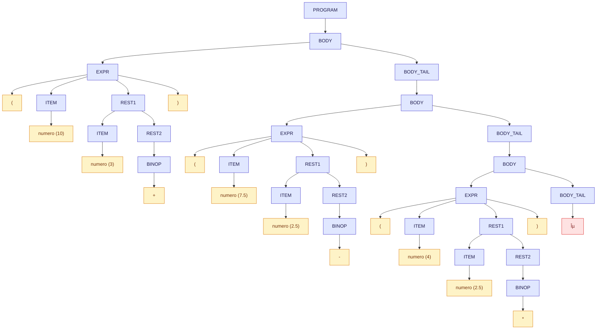
```mermaid
graph TD
    PROGRAM["PROGRAM"] --> BODY1["BODY"]

    BODY1 --> E1["EXPR"]
    BODY1 --> BT1["BODY_TAIL"]

    E1 --> P1["("]
    E1 --> I1["ITEM"]
    E1 --> R1["REST1"]
    E1 --> P1c[")"]
    I1 --> N10["numero (10)"]
    R1 --> I1b["ITEM"]
    R1 --> R1b["REST2"]
    I1b --> N3["numero (3)"]
    R1b --> B1["BINOP"]
    B1 --> OP1["+"]

    BT1 --> BODY2["BODY"]
    BODY2 --> E2["EXPR"]
    BODY2 --> BT2["BODY_TAIL"]

    E2 --> P2["("]
    E2 --> I2["ITEM"]
    E2 --> R2["REST1"]
    E2 --> P2c[")"]
    I2 --> N75["numero (7.5)"]
    R2 --> I2b["ITEM"]
    R2 --> R2b["REST2"]
    I2b --> N25["numero (2.5)"]
    R2b --> B2["BINOP"]
    B2 --> OP2["-"]

    BT2 --> BODY3["BODY"]
    BODY3 --> E3["EXPR"]
    BODY3 --> BT3["BODY_TAIL"]

    E3 --> P3["("]
    E3 --> I3["ITEM"]
    E3 --> R3["REST1"]
    E3 --> P3c[")"]
    I3 --> N4["numero (4)"]
    R3 --> I3b["ITEM"]
    R3 --> R3b["REST2"]
    I3b --> N25b["numero (2.5)"]
    R3b --> B3["BINOP"]
    B3 --> OP3["*"]

    BT3 --> EPS["ε"]

    classDef nt fill:#e0e7ff,stroke:#4338ca,color:#1e1b4b
    classDef term fill:#fef3c7,stroke:#d97706,color:#78350f
    classDef eps fill:#fee2e2,stroke:#dc2626,color:#7f1d1d
    class PROGRAM,BODY1,BODY2,BODY3,BT1,BT2,BT3,E1,E2,E3,I1,I1b,I2,I2b,I3,I3b,R1,R1b,R2,R2b,R3,R3b,B1,B2,B3 nt
    class P1,P1c,P2,P2c,P3,P3c,N10,N3,N75,N25,N4,N25b,OP1,OP2,OP3 term
    class EPS eps
```

**Como ler:**

- **Caixas azuis** = não-terminais (símbolos da gramática);
- **Caixas amarelas** = terminais (tokens reais consumidos do buffer);
- **Caixa vermelha (`ε`)** = produção vazia (regra de fechamento de `BODY_TAIL` quando o próximo token é `$`).

**Relação com o algoritmo LL(1):**

1. O parser começa com a pilha `['$', 'PROGRAM']` (raiz da árvore acima).
2. A cada passo, o **topo da pilha** é um não-terminal: o parser olha o próximo token (lookahead de 1) e consulta `M[topo, token]` para decidir **qual filho criar** — isso corresponde a expandir um nó da árvore.
3. Quando o topo é terminal e casa com o token, a folha amarela é "fechada" (token consumido).
4. A árvore é construída **de cima para baixo, da esquerda para a direita** — exatamente o significado de *descendente recursivo LL(1)*.

> Para uma derivação completa de qualquer execução, abra
> `output/derivacao_ultima_execucao.md` (gerado a cada `python AnalisadorSemantico.py …`).
> Cada linha lá corresponde a uma expansão de não-terminal — i.e., a um nó interno desta árvore.

---

## 13. Pré-processamento de comentários (Fase 3)

Comentários `*{ ... }*` (estilo Pascal, **não aninháveis**) são
**removidos antes do AFD**, em um passo dedicado `_strip_comentarios`
em `src/lexer_fsm.py`. Isso mantém o AFD principal idêntico ao da
Fase 1 e simplifica a contabilidade de linha/coluna.

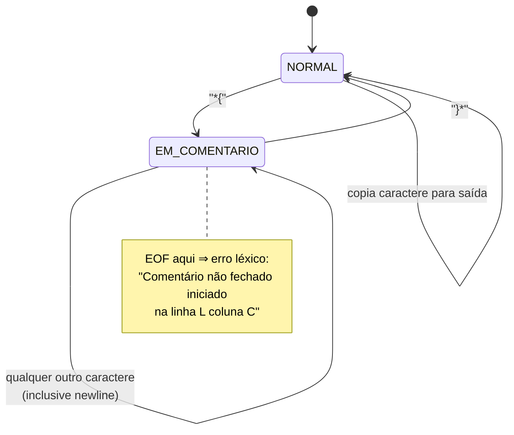
```mermaid
stateDiagram-v2
    [*] --> NORMAL
    NORMAL --> EM_COMENTARIO : "*{"
    EM_COMENTARIO --> NORMAL : "}*"
    EM_COMENTARIO --> EM_COMENTARIO : qualquer outro caractere<br/>(inclusive newline)
    NORMAL --> NORMAL : copia caractere para saída

    note right of EM_COMENTARIO
      EOF aqui ⇒ erro léxico:
      "Comentário não fechado iniciado
      na linha L coluna C"
    end note
```

**Invariantes preservadas:**

1. Cada caractere de comentário é trocado por um espaço — **linhas e
   colunas dos tokens reais permanecem inalteradas**.
2. Quebras de linha dentro do comentário **não são removidas**, para
   que o número de linhas do arquivo continue batendo com o original.
3. O AFD a jusante (§5) recebe apenas tokens "limpos" — não precisa
   conhecer comentários.
4. Quando `manter_comentarios=True`, o lexer emite tokens
   `COMENTARIO` com `lexema` = texto bruto e linha/coluna de abertura.

Pipeline atualizado da Fase 3:

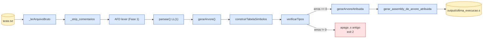
```mermaid
flowchart LR
    A[("teste.txt")] --> B["_lerArquivoBruto"]
    B --> S["_strip_comentarios"]
    S --> C["AFD lexer (Fase 1)"]
    C --> D["parsear() LL(1)"]
    D --> E["gerarArvore()"]
    E --> F["construirTabelaSimbolos"]
    F --> G["verificarTipos"]
    G -->|erros == 0| H["gerarArvoreAtribuida"]
    H --> I["gerar_assembly_de_arvore_atribuida"]
    I --> J[("output/ultima_execucao.s")]
    G -->|erros != 0| X["apaga .s antigo<br/>exit 2"]
    classDef io fill:#fef3c7,stroke:#d97706
    classDef step fill:#dbeafe,stroke:#1d4ed8
    classDef err fill:#fee2e2,stroke:#dc2626
    class A,J io
    class B,S,C,D,E,F,G,H,I step
    class X err
```

---

## 15. Ciclo de vida da Tabela de Símbolos (Fase 3)

Mostra como cada operação sobre uma variável `MEM` é processada por
`TabelaSimbolos` em `src/semantica.py`. O **tipo é fixado na primeira
definição** e qualquer redefinição com tipo diferente vira erro
semântico (recuperação: a entrada original permanece).

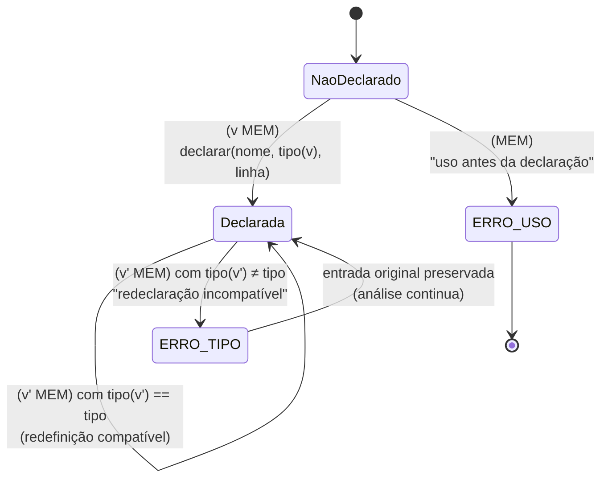
```mermaid
stateDiagram-v2
    [*] --> NaoDeclarado

    NaoDeclarado --> Declarada : (v MEM)<br/>declarar(nome, tipo(v), linha)
    NaoDeclarado --> ERRO_USO : (MEM)<br/>"uso antes da declaração"

    Declarada --> Declarada : (MEM)<br/>usar(nome, linha)<br/>append linhas_uso
    Declarada --> Declarada : (v' MEM) com tipo(v') == tipo<br/>(redefinição compatível)
    Declarada --> ERRO_TIPO : (v' MEM) com tipo(v') ≠ tipo<br/>"redeclaração incompatível"

    ERRO_USO --> [*]
    ERRO_TIPO --> Declarada : entrada original preservada<br/>(análise continua)
```

**Entrada na tabela** (uma por nome):

| Campo | Tipo | Quando é preenchido |
|---|---|---|
| `nome` | `str` | `declarar()` |
| `tipo` | `int` / `real` / `bool` / `indef` | `declarar()` (1ª vez); promovido de `indef` se necessário |
| `linha_def` | `int` | `declarar()` (1ª vez) |
| `linhas_uso` | `list[int]` | `usar()` a cada `(MEM)` |
| `escopo` | `"global"` | constante (linguagem tem escopo único) |

---

## 16. Inferência de tipos em operadores binários

Decisão tomada por `inferir_tipo_binario(op, τ1, τ2)` em
`src/semantica.py`. Reflete diretamente as regras T-Arith, T-IntDiv,
T-RealDiv e T-Rel de [regras_tipos.md](../regras_tipos.md).

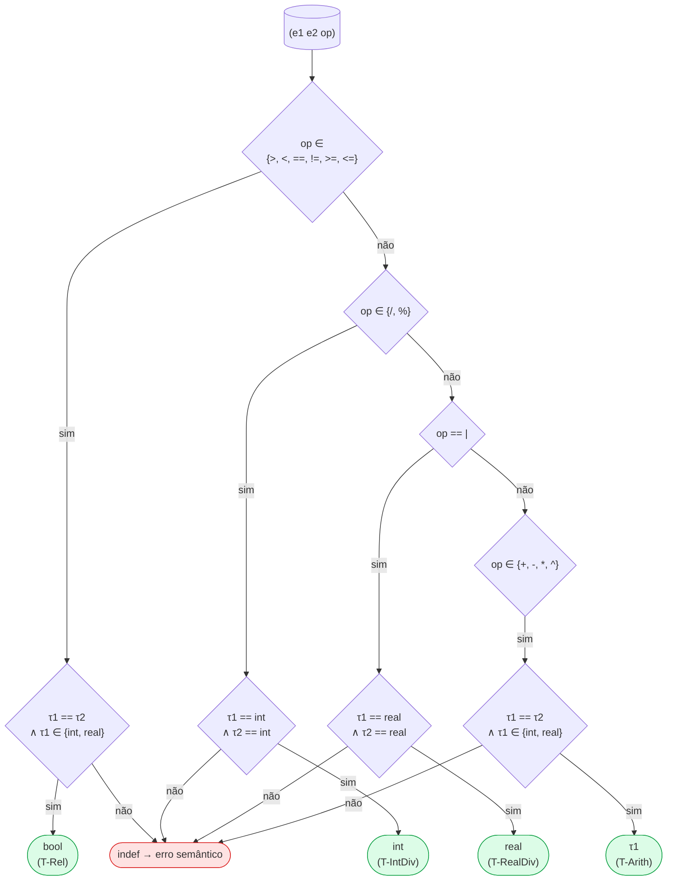
```mermaid
flowchart TD
    A[("(e1 e2 op)")] --> B{"op ∈<br/>{>, <, ==, !=, >=, <=}"}
    B -- sim --> R1{"τ1 == τ2<br/>∧ τ1 ∈ {int, real}"}
    R1 -- sim --> RB(["bool<br/>(T-Rel)"])
    R1 -- não --> ERR(["indef → erro semântico"])

    B -- não --> C{"op ∈ {/, %}"}
    C -- sim --> D{"τ1 == int<br/>∧ τ2 == int"}
    D -- sim --> RI(["int<br/>(T-IntDiv)"])
    D -- não --> ERR

    C -- não --> E{"op == |"}
    E -- sim --> F{"τ1 == real<br/>∧ τ2 == real"}
    F -- sim --> RR(["real<br/>(T-RealDiv)"])
    F -- não --> ERR

    E -- não --> G{"op ∈ {+, -, *, ^}"}
    G -- sim --> H{"τ1 == τ2<br/>∧ τ1 ∈ {int, real}"}
    H -- sim --> RT(["τ1<br/>(T-Arith)"])
    H -- não --> ERR

    classDef ok fill:#dcfce7,stroke:#16a34a
    classDef err fill:#fee2e2,stroke:#dc2626
    class RB,RI,RR,RT ok
    class ERR err
```

> **Sem promoção implícita:** `(1 2.5 +)` é rejeitado, **não** convertido
> para `(1.0 2.5 +)`. Isso é uma decisão de projeto — ver §3 do
> README e o cabeçalho de `regras_tipos.md`.

---

## 17. Cálculo de sequentes — exemplo de derivação

Derivação formal (estilo árvore de prova) do tipo da expressão
`((CONT) 0 >)` num contexto `Γ = {CONT : int}`. Cada nó interno é uma
regra de tipo; as folhas são axiomas (`T-IntLit`, `T-MemRead`).

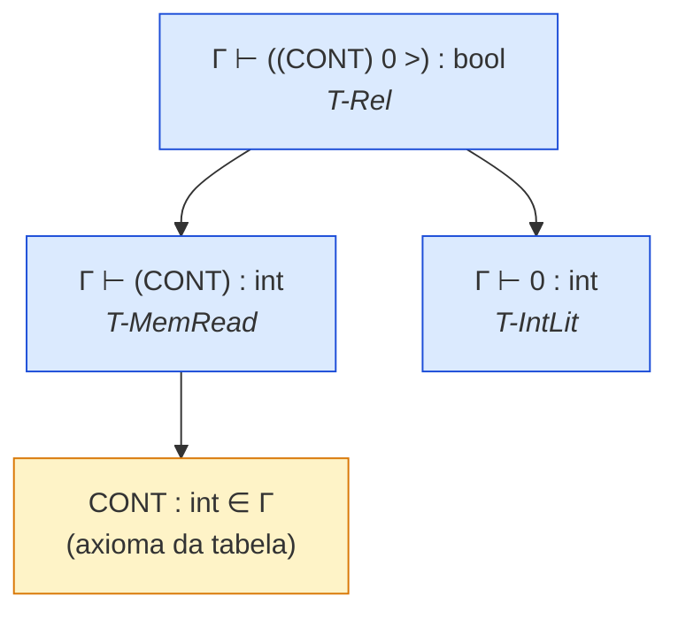
```mermaid
graph TD
    R["Γ ⊢ ((CONT) 0 >) : bool<br/><i>T-Rel</i>"]
    L["Γ ⊢ (CONT) : int<br/><i>T-MemRead</i>"]
    M["Γ ⊢ 0 : int<br/><i>T-IntLit</i>"]
    AX1["CONT : int ∈ Γ<br/>(axioma da tabela)"]

    R --> L
    R --> M
    L --> AX1

    classDef rule fill:#dbeafe,stroke:#1d4ed8
    classDef ax fill:#fef3c7,stroke:#d97706
    class R,L,M rule
    class AX1 ax
```

E o caso composto `(((CONT) 0 >) (((CONT) 1 -) CONT) WHILE)`
(decremento de `CONT` enquanto positivo):

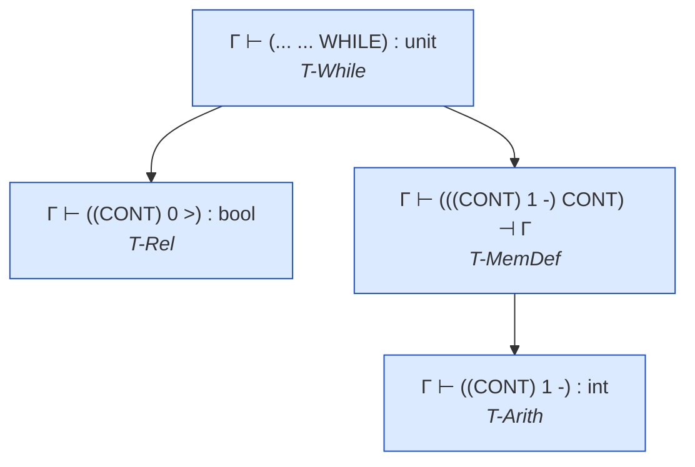
```mermaid
graph TD
    W["Γ ⊢ (... ... WHILE) : unit<br/><i>T-While</i>"]
    COND["Γ ⊢ ((CONT) 0 >) : bool<br/><i>T-Rel</i>"]
    BODY["Γ ⊢ (((CONT) 1 -) CONT) ⊣ Γ<br/><i>T-MemDef</i>"]
    SUB["Γ ⊢ ((CONT) 1 -) : int<br/><i>T-Arith</i>"]

    W --> COND
    W --> BODY
    BODY --> SUB

    classDef rule fill:#dbeafe,stroke:#1d4ed8
    class W,COND,BODY,SUB rule
```

> `T-MemDef` produz um sequente `Γ ⊢ e ⊣ Γ'` (com judgment de
> **atualização** do contexto): após `(v CONT)`, a tabela passa a
> conter `CONT : tipo(v)`.

---

## 18. Estrutura da Árvore Sintática Atribuída (Fase 3)

Estende os tipos de nó da §7 com os atributos sintetizados pela
verificação de tipos e a anotação de geração de código.

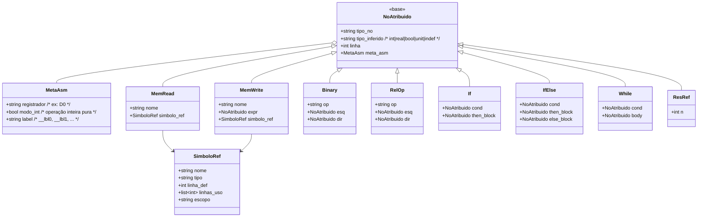
```mermaid
classDiagram
    class NoAtribuido {
        <<base>>
        +string tipo_no
        +string tipo_inferido  /* int|real|bool|unit|indef */
        +int linha
        +MetaAsm meta_asm
    }
    class MetaAsm {
        +string registrador  /* ex: D0 */
        +bool modo_int       /* operação inteira pura */
        +string label        /* __lbl0, __lbl1, ... */
    }
    class MemRead {
        +string nome
        +SimboloRef simbolo_ref
    }
    class MemWrite {
        +string nome
        +NoAtribuido expr
        +SimboloRef simbolo_ref
    }
    class Binary {
        +string op
        +NoAtribuido esq
        +NoAtribuido dir
    }
    class RelOp {
        +string op
        +NoAtribuido esq
        +NoAtribuido dir
    }
    class If {
        +NoAtribuido cond
        +NoAtribuido then_block
    }
    class IfElse {
        +NoAtribuido cond
        +NoAtribuido then_block
        +NoAtribuido else_block
    }
    class While {
        +NoAtribuido cond
        +NoAtribuido body
    }
    class ResRef {
        +int n
    }
    class SimboloRef {
        +string nome
        +string tipo
        +int linha_def
        +list~int~ linhas_uso
        +string escopo
    }

    NoAtribuido <|-- MemRead
    NoAtribuido <|-- MemWrite
    NoAtribuido <|-- Binary
    NoAtribuido <|-- RelOp
    NoAtribuido <|-- If
    NoAtribuido <|-- IfElse
    NoAtribuido <|-- While
    NoAtribuido <|-- ResRef
    NoAtribuido o-- MetaAsm
    MemRead --> SimboloRef
    MemWrite --> SimboloRef
```

Os atributos `meta_asm.*` são populados por `gerarArvoreAtribuida()`
**após** `verificarTipos()` ter rodado sem erros — é o que o gerador
ARMv7 consome (§19).

---

## 19. Decisão int × real no gerador ARMv7

Como `gerar_assembly_de_arvore_atribuida()` escolhe a instrução ARMv7
correta para cada operador binário, baseada em `tipo_inferido` e na
flag `meta_asm.modo_int`. Reflete a separação operacional entre
aritmética inteira (registradores `R*`) e ponto-flutuante VFP
(registradores `D*`).

```mermaid
flowchart TD
    N[("nó binário<br/>op ∈ {+ - * | / % ^ rel}")] --> T{"tipo_inferido"}

    T -- int --> I{"op"}
    I -- "+ - *" --> I1["ADD / SUB / MUL<br/>(R-regs)"]
    I -- "/ %" --> I2["SDIV + MLS<br/>(divisão inteira)"]
    I -- "^" --> I3["loop MUL<br/>(potência inteira)"]
    I -- "> < == != >= <=" --> I4["CMP + Bcc<br/>→ flag bool em R*"]

    T -- real --> F{"op"}
    F -- "+ - *" --> F1["VADD.F64 / VSUB.F64 / VMUL.F64<br/>(D-regs)"]
    F -- "|" --> F2["VDIV.F64"]
    F -- "^" --> F3["loop VMUL.F64"]
    F -- "> < == != >= <=" --> F4["VCMP.F64 + VMRS<br/>+ Bcc → flag bool"]

    T -- bool --> B1["valor já em R0/R1<br/>(resultado de relacional)"]

    T -- unit --> U1["nada a emitir<br/>(WHILE / atribuição puro efeito)"]

    classDef int fill:#dbeafe,stroke:#1d4ed8
    classDef real fill:#dcfce7,stroke:#16a34a
    classDef bool fill:#fef3c7,stroke:#d97706
    classDef unit fill:#f3f4f6,stroke:#6b7280
    class I,I1,I2,I3,I4 int
    class F,F1,F2,F3,F4 real
    class B1 bool
    class U1 unit
```

---

## 20. Máquina de estados das fases e exit codes

Estado global de uma execução do CLI. Cada transição "erro" aborta a
fase atual, **remove qualquer `output/ultima_execucao.s` antigo** e
encerra com o exit code correspondente — invariante crítica para que
o avaliador nunca execute Assembly obsoleto.

```mermaid
stateDiagram-v2
    [*] --> Lexico
    Lexico --> Sintatico : tokens OK
    Lexico --> ERRO_LEXSINT : token inválido / comentário não fechado

    Sintatico --> TabelaSimbolos : AST construída
    Sintatico --> ERRO_LEXSINT : parser LL(1) falha

    TabelaSimbolos --> VerificarTipos : tabela construída

    VerificarTipos --> ArvoreAtribuida : 0 erros semânticos
    VerificarTipos --> ERRO_SEMANTICO : ≥ 1 erro semântico

    ArvoreAtribuida --> GerarAssembly : árvore anotada
    GerarAssembly --> SUCESSO : .s gravado

    ERRO_LEXSINT --> EXIT_1 : escreve erros_lexsint.md<br/>apaga .s antigo
    ERRO_SEMANTICO --> EXIT_2 : escreve erros_semanticos.md<br/>salva árvore parcial<br/>apaga .s antigo
    SUCESSO --> EXIT_0

    EXIT_0 --> [*]
    EXIT_1 --> [*]
    EXIT_2 --> [*]
```

| Exit | Significado | Artefatos garantidos |
|:---:|---|---|
| `0` | Sem erros | `ultima_execucao.s`, `arvore_atribuida.*`, `tabela_simbolos.md`, `erros_semanticos.md` (vazio) |
| `1` | Erro léxico/sintático | `erros_lexsint.md` (sem `.s`) |
| `2` | Erro semântico | `erros_semanticos.md`, `tabela_simbolos.md`, `arvore_atribuida.*` parcial (sem `.s`) |

---

## 21. Como atualizar este documento

Sempre que a gramática, o parser, a semântica ou o gerador ARMv7 mudarem:

1. Atualize o(s) diagrama(s) afetado(s) neste arquivo.
2. Rode `python AnalisadorSemantico.py teste1.txt` para regenerar todos os artefatos em `output/`
   (inclui `gramatica_dump.md`, `derivacao_ultima_execucao.md`, `arvore_ultima_execucao.json/.md`,
   `tabela_simbolos.md`, `arvore_atribuida.json/.md`, `ultima_execucao.s`).
3. Rode `python -m unittest discover -s tests` para garantir que os **108 testes** continuam passando.

